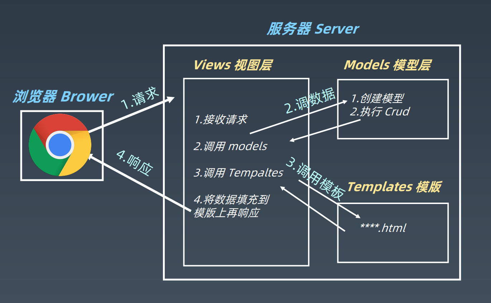

学习笔记

## MTV 框架模式

- 模型（Model）
- 模板（Template）
- 视图（Views）  



## 安装 Django

在虚拟环境中

```bash
python -m pip install Django
```

指定安装版本

```bash
pip install --upgrade django==2.2.13  
```

查看版本

```
>>> import django
>>> django.__version__
'2.2.13'  
```

## 创建 Django 项目  

```bash
django-admin startproject mysite  
```

⽬录结构如下：  

```
mysite/
    manage.py				命令⾏⼯具
    mysite/
        __init__.py
        settings.py			项⽬的配置⽂件
        urls.py
        asgi.py
        wsgi.py
```

## 启动服务器

```bash
python manage.py runserver
```

**更换端口**

```bash
python manage.py runserver 8080
```

## 创建应用

```bash
python manage.py startapp polls
```

目录结构大致如下：

```
polls/
    __init__.py
    admin.py
    apps.py
    migrations/
        __init__.py
    models.py
    tests.py
    views.py
```

### setting.py的处理

注册 APP

```python
INSTALLED_APPS=[
    'django.contrib.admin',
    'django.contrib.auth',
    'django.contrib.contenttypes',
    'django.contrib.sessions',
    'django.contrib.messages',
    'django.contrib.staticfiles',
    'movie',
]
```

数据库

```python
DATABASES = {
    'default': {
            'ENGINE': 'django.db.backends.mysql',
            'NAME': 'geekbang',
            'USER': 'root',
            'PASSWORD': '',
            'HOST': 'localhost',
            'PORT': '3306',
	}
}  
```


### 模型的处理

从 Django 到 SQL
```bash
python manage.py makemigrations
python manage.py migrate
```

从 SQL 到 Django
```bash
python manage.py inspectdb
```

## 增加项目urls

```python
# mysite/urls.py
from django.contrib import admin
from django.urls import path, include

urlpatterns = [
    path('admin/', admin.site.urls),
    path('',include('index.urls')),
]


# index/urls.py
from django.urls import path
from . import views
urlpatterns = [
	path('', views.index)
]


# index/views.py
from django.shortcuts import render
from django.http import HttpResponse
def index(request):
	return HttpResponse("Hello Django!")
```

## HTTP状态码

| 响应类型                                 | 说明                                           |
| ---------------------------------------- | ---------------------------------------------- |
| HttpResponse(‘Hello world’)              | HTTP 状态码 200，请求已成功被服务器接收        |
| HttpResponseRedirect(‘/admin/’)          | HTTP 状态码 302，重定向 Admin 站点的 URL       |
| HttpResponsePermanentRedirect(‘/admin/’) | HTTP 状态码 301，永久重定向 Admin 站点URL      |
| HttpResponseBadRequest(‘BadRequest’)     | HTTP 状态码 400，访问的页面不存在或者请求错误  |
| HttpResponseNotFound(‘NotFound’)         | HTTP 状态码 404，页面不存在或者网页的 URL 失效 |
| HttpResponseForbidden(‘NotFound’)        | HTTP 状态码 403，没有访问权限                  |
| HttpResponseNotAllowed(‘NotAllowedGet’)  | HTTP 状态码 405，不允许使用该请求方式          |
| HttpResponseSeverError(‘SeverError’)     | HTTP 状态码 500，服务器内容错误                |