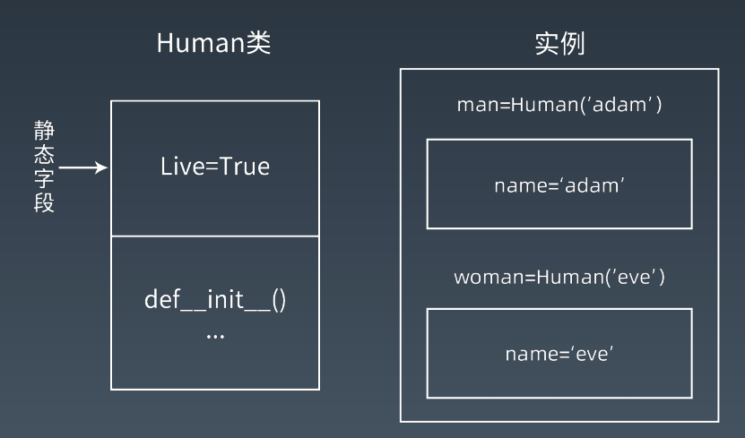
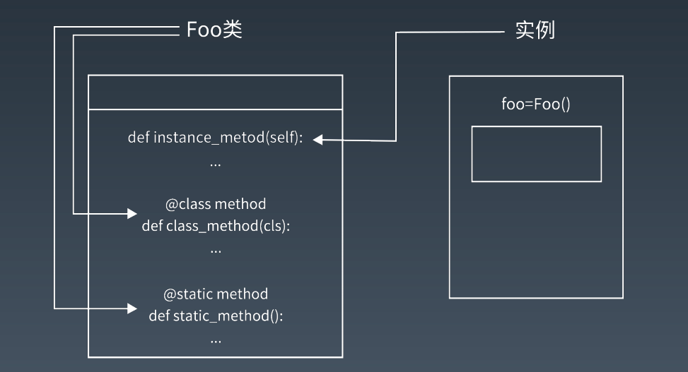

学习笔记

## 属性

### 类属性与对象属性

```python
class Dog:

    kind = 'canine'         # class variable shared by all instances

    def __init__(self, name):
        self.name = name    # instance variable unique to each instanc
```

类属性字段在内存中只保存一份，对象属性在每个对象都保存一份  



### 属性作用域  

#### 作用域：

- `_name` 人为约定不可修改
- `__name` 私有属性
- `__name__` 魔术方法  

#### 魔术方法：

- 双下划线开头和结尾的方法，实现了类的特殊成员，这类称作魔术方法
- 不是所有的双下划线开头和结尾的方法都是魔术方法
- 魔术方法类似其他语言的接口
- 私有属性是可以访问到的，Python 通过改名机制隐藏了变量名称
  - `class.__dict__` 

### 方法  

#### 普通方法 

至少一个 self 参数，表示该方法的对象

#### 类方法 

至少一个 cls 参数，表示该方法的类

#### 静态方法 

由类调用，无参数

三种方法在内存中都归属于类  



### 特殊属性与方法  

#### `__init__()`

-  `__init__()` 方法所做的工作是在类的对象创建好之后进行变量的初始化。
-  `__init__()` 方法不需要显式返回，默认为 None，否则会在运行时抛出 TypeError。

#### self

- self 表示实例对象本身
- self 不是 Python 的关键字（cls也不是），可以将 self 替换成任何你喜欢的名称，
  如 this、obj 等，实际效果和 self 是一样的（不推荐）。
- 在方法声明时，需要定义 self 作为第一个参数，调用方法的时候不用传入 self。  

### 属性的处理  

在类中，需要对实例获取属性这一行为进行操作，可以使用：

- `__getattribute__()`

- `__getattr__()`

异同：

- 都可以对实例属性进行 获取拦截
-  `__getattr__()` 适用于未定义的属性，属性不在`__dict__`内，该函数会拦截
-  `__getattribute__()` 对所有属性的访问都会调用该方法  

当`__getattribute__()`和`__getattr__()`都定义了的时候

运行顺序为

```python
class Human2(object):    
    """
    同时存在的调用顺序
    """
    def __init__(self):
        self.age = 18

    def __getattr__(self, item): 

        print('Human2:__getattr__')
        return 'Err 404 ,你请求的参数不存在'

    def __getattribute__(self, item):
        print('Human2:__getattribute__')
        return super().__getattribute__(item)

h1 = Human2()

# 如果同时存在，执行顺序是 __getattribute__ > __getattr__ > __dict__
print(h1.age)
print(h1.noattr)
# 注意输出，noattr的调用顺序

"""
>>>print(h1.noattr)
Human2:__getattribute__
Human2:__getattr__
Err 404 ,你请求的参数不存在
"""
```

### 属性描述符 property  

将一个getter方法变为属性

描述符：实现特定协议的类
property 类需要实现 `__get__`、`__set__`、 `__delete__` 方法  

```python
class Teacher:
    def __init__(self, name):
    	self.name = name
    def __get__(self):
    	return self.name
    def __set__(self, value):
    	self.name = value

pythonteacher = Teacher('yin')
pythonteacher.name = 'wilson'
print(pythonteacher.name)
```

使用规则：

- **只读属性**：只有getter方法，在方法前加上@property；
- **可读可写属性**：有getter和setter方法，在setter方法上使用@属性名.setter。

```python
class Student(object):
    
    def __init__(self,score):
         self.__score = score      ## __score 翻译成 _Student__score
   	# score：可读可写属性， getter与setter方法
 
	# 把一个getter方法变成属性，只需要加上@property就可以了
    @property
    def score(self):
        return self._score

    # 创建另一个装饰器@score.setter,负责把一个setter方法变成属性赋值
    @score.setter
    def score(self,value):
    	if not isinstance(value,int):
        	raise ValueError('score must be an integer ! ')
        if value<0 or value>100:
            raise ValueError ('score must between 0 - 100 ! ')
        self.score = value

    # 定义只读属性，只定义getter方法
    @property
    def age(self):
        return self._age
```


## 面向对象编程的特性  

### 封装

• 将内容封装到某处
• 从某处调用被封装的内容

### 继承

• 基本继承
• 多重继承

### 重载

• Python 无法在语法层面实现数据类型重载，需要在代码逻辑上实现
• Python 可以实现参数个数重载

### 多态

• Pyhon 不支持 Java 和 C# 这一类强类型语言中多态的写法，
• Python 使用“鸭子类型”  

## 新式类  

### 新式类和经典类的区别

当前类或者父类继承了 object 类，那么该类便是新式类，否则便是经典类

### object 和 type 的关系

- object 和 type 都属于 type 类 (class 'type')
- type 类由 type 元类自身创建的。object 类是由元类 type 创建
- object 的父类为空，没有继承任何类
- type 的父类为 object 类 (class 'object')  

## 类的继承  

• 单一继承
• 多重继承
• 菱形继承（钻石继承）
• 继承机制 MRO
• MRO 的 C3 算法  

https://www.cnblogs.com/gandoufu/p/9634914.html

### 多重继承的顺序问题  

有向无环图：DAG(Directed Acyclic Graph)
• DAG 原本是一种数据结构，因为 DAG 的拓扑结构带来的优异特性，经常被用于处
理动态规划、寻求最短路径的场景。  

## SOLID 设计原则  

- 单一责任原则 The Single Responsibility Principle
- 开放封闭原则 The Open Closed Principle
- 里氏替换原则 The Liskov Substitution Principle
- 依赖倒置原则 The Dependency Inversion Principle
- 接口分离原则 The Interface Segregation Principle  

## 单例模式  

1. 对象只存在一个实例
2. `__init__ `和 `__new__` 的区别：
   - `__new__` 是实例创建之前被调用，返回该实例对象，是静态方法
   - `__init__` 是实例对象创建完成后被调用，是实例方法
   - `__new__` 先被调用，`__init__` 后被调用
   - `__new__` 的返回值（实例）将传递给 `__init__` 方法的第一个参数，`__init__` 给这个
     实例设置相关参数  

```python
# 装饰器实现单实例模式
def singleton(cls):
    instances = {}
    def getinstance():
        if cls not in instances:
            instances[cls] = cls()
        return instances[cls]
    return getinstance

@singleton 
class MyClass:
    pass
```

```python
# __new__ 方式实现单例模式
class Singleton2(object):
	__isinstance = False  # 默认没有被实例化
	def __new__(cls, *args, **kwargs):
		if cls.__isinstance:  
			return cls.__isinstance  # 返回实例化对象
		cls.__isinstance = object.__new__(cls)  # 实例化
		return cls.__isinstance


# object定义了一个名为Singleton的单例，它满足单例的3个需求：
# 一是只能有一个实例；
# 二是它必须自行创建这个实例；
# 三是它必须自行向整个系统提供这个实例。
```

```python
#方法1,实现__new__方法
#并在将一个类的实例绑定到类变量_instance上,
#如果cls._instance为None说明该类还没有实例化过,实例化该类,并返回
#如果cls._instance不为None,直接返回cls._instance
class Singleton(object):
    _instance = None
    def __new__(cls, *args, **kargs):
        if not cls._instance:
            cls._instance = super(Singleton, cls).__new__(
                                cls, *args, **kargs)
        return cls._instance

if __name__ == '__main__':
    s1 = Singleton()
    s2 = Singleton()
    assert id(s1) == id(s2)
```

```python
# 解决并发，引入带锁版
import threading
class Singleton(object):
    objs = {}
    objs_locker = threading.Lock()
    def __new__(cls, *args, **kargs):
        if cls in cls.objs:
            return cls.objs[cls]
        cls.objs_locker.acquire()
        try:
            if cls in cls.objs: ## double check locking
                return cls.objs[cls]
            cls.objs[cls] = object.__new__(cls)
        finally:
            cls.objs_locker.release()
```

还可以使用python的模块机制

import机制是线程安全的（保证了在并发状态下模块也只有一个实例）。

```python
# World.py
import Sun
def run():
    while True:
        Sun.rise()
        Sun.set()

# main.py
import World
World.run()
```

## 抽象基类  

- 抽象基类（abstract base class，ABC）用来确保派生类实现了基类中的特定方法。
- 使用抽象基类的好处：
  - 避免继承错误，使类层次易于理解和维护。
  - 无法实例化基类。
  - 如果忘记在其中一个子类中实现接口方法，要尽早报错。

```python
from abc import ABC
class MyABC(ABC):
pass
MyABC.register(tuple)
assert issubclass(tuple, MyABC)
assert isinstance((), MyABC)  
```